# HAGI Architecture Diagrams

Mermaid-compatible diagrams mapping to HAGI subsystems and pipeline stages.

---

## 1. High-Level System Architecture

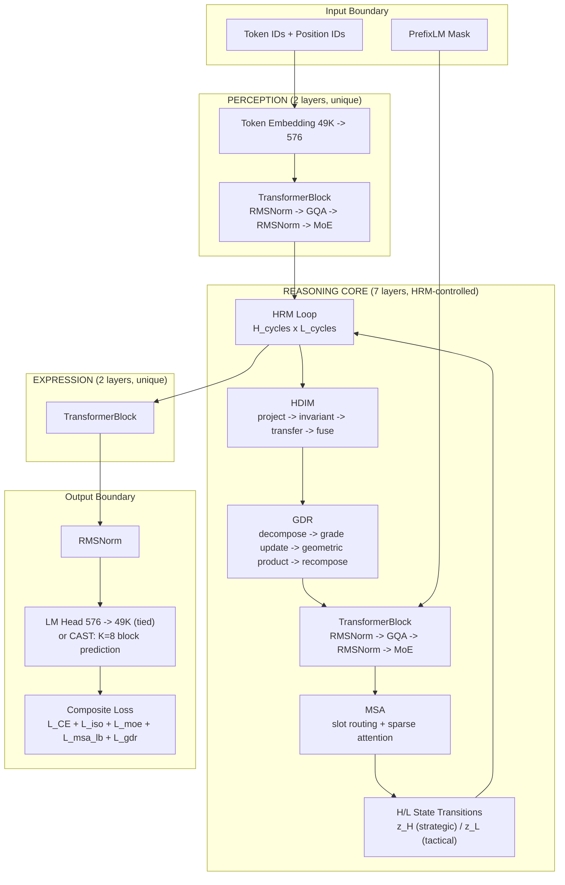

---

## 2. HRM Recurrence Algorithm

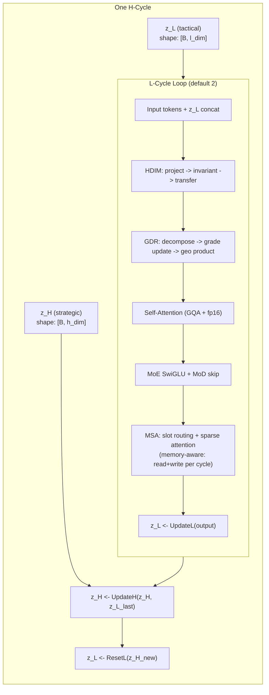

**Algorithm (pseudocode)**

```
function HRMForward(tokens, z_H, z_L, prefix_mask):
    for h in 1..H_cycles (default 1):
        for l in 1..L_cycles (default 2):
            x = Embed(tokens) + project_z_L(z_L)
            x = HDIM(x)           # invariant transfer
            x = GDR(x)            # grade-decomposed update
            x = TransformerBlock(x, mask=prefix_mask)
            x = MSA(x)            # memory-aware slot routing
            z_L = UpdateL(x, z_L) # tactical recurrence
        z_H = UpdateH(z_H, z_L)   # strategic update
        z_L = ResetL(z_H)         # tactical reset
    return logits, z_H, z_L
```

---

## 3. GDR Grade Decomposition

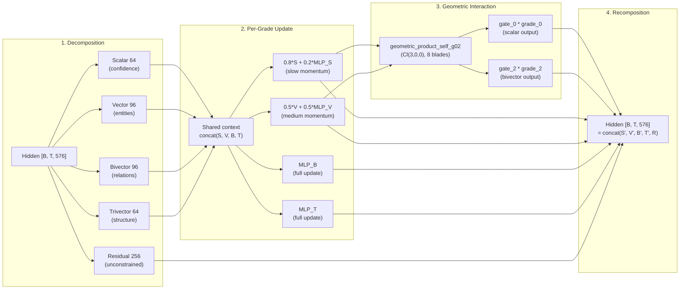

---

## 4. HDIM Domain Transfer Pipeline

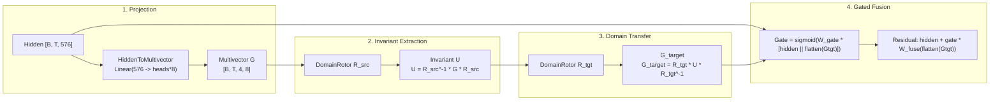

**Rotor Schedule**: 4 parallel rotors, LCG-based index selection (deterministic, no GPU sync). `rotor_seed=42` for reproducibility.

---

## 5. MSA Sparse Routing

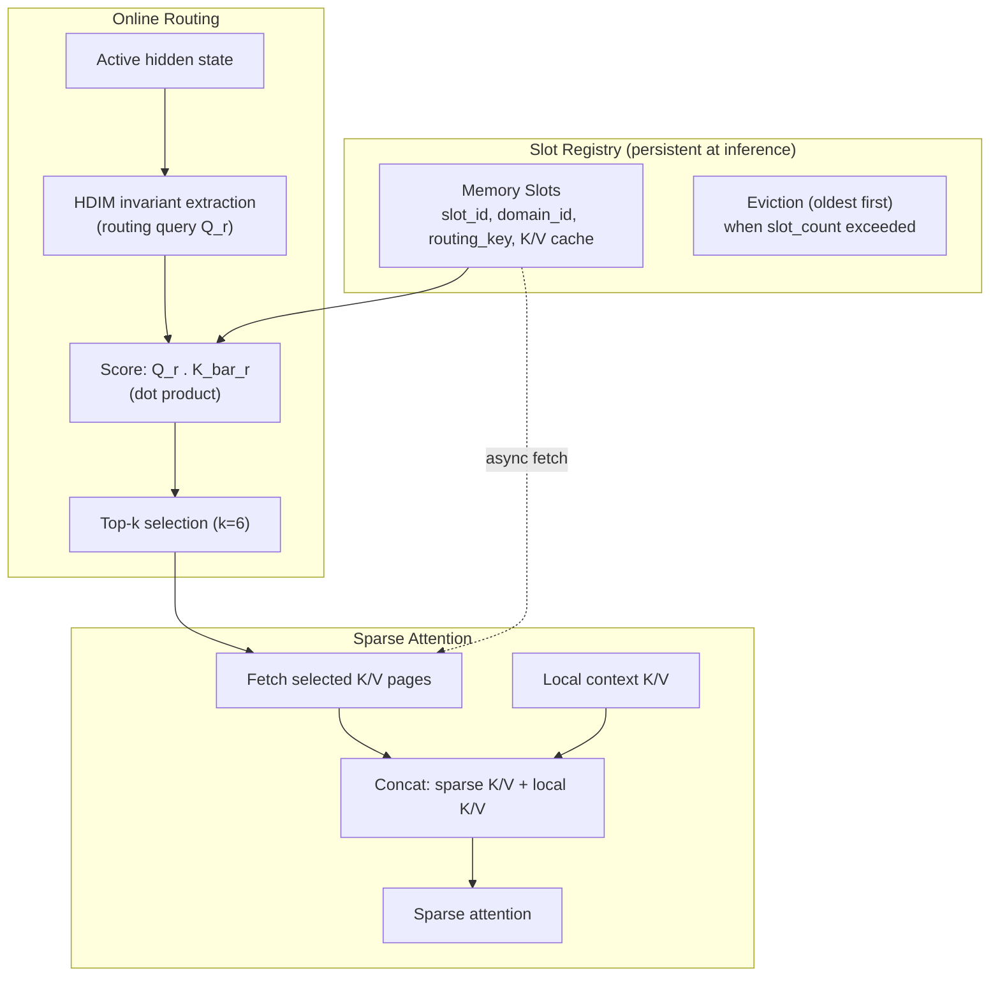

**Training**: registry cleared every forward pass.
**Inference**: persistent registry accumulates across decode steps.

---

## 6. MoE + Mixture-of-Depths

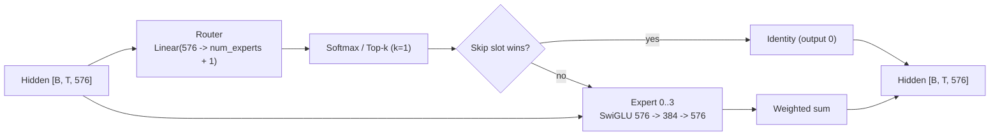

**MoD skip**: trivial tokens bypass experts entirely (residual identity). Skip slot excluded from load-balance aux loss.

---

## 7. CAST Block Generation

```mermaid
flowchart LR
    H["Hidden [B, T, 576]"]
    PROJ["block_proj<br/>Linear(576 -> K*576)"]
    RESHAPED["[B, T, K=8, 576]"]
    MV["Multivectors<br/>[B, T, K, 72, 8]"]
    GEO["geometric_product<br/>(adjacent K positions)"]
    AREA["Bivector area<br/>(cross-token coherence)"]
    MOD["Area modulates<br/>neighbour virtual states"]
    FLAT["[B, T, K, 576]"]
    DECODE["final_norm + lm_head<br/>(shared, per k position)"]
    TOKENS["K=8 token predictions"]

    H --> PROJ --> RESHAPED --> MV --> GEO --> AREA --> MOD --> FLAT --> DECODE --> TOKENS
```

**Training**: `train_k=3` subsamples CE loss positions (always k=0 + 2 random from k=1..7).
**Inference**: all K=8 positions used. 8x fewer forward passes.

---

## 8. Composite Loss

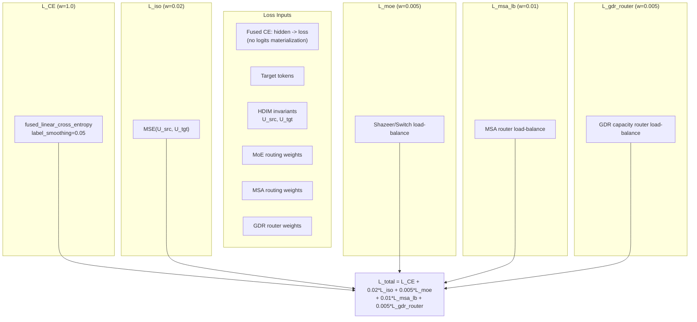

**Warmup**: all auxiliary losses ramp from 0 to target over 1000 steps.

---

## 9. Training Pipeline

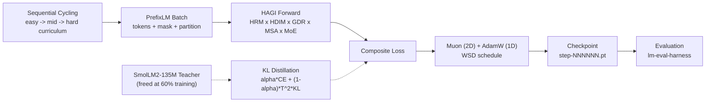

---

## 10. Reasoning Cache Decoding

```mermaid
flowchart LR
    PROMPT["User prompt"]
    TURN1["Turn 1"]
    GEN1["Generate reasoning trace<br/>z_R (H_R=512 tokens)"]
    SUM1["Summarize<br/>z_S (H_S=128 tokens)"]
    CACHE1["Cache z_S^(1)"]

    TURN2["Turn 2"]
    GEN2["Generate reasoning trace<br/>conditioned on prompt + z_S^(1)"]
    SUM2["Summarize z_S^(2)"]
    CACHE2["Cache z_S^(2)"]

    TURN3["Turn 3 (final)"]
    GEN3["Generate final response"]
    OUTPUT["Output"]

    PROMPT --> TURN1
    TURN1 --> GEN1 --> SUM1 --> CACHE1
    CACHE1 --> TURN2
    TURN2 --> GEN2 --> SUM2 --> CACHE2
    CACHE2 --> TURN3
    TURN3 --> GEN3 --> OUTPUT
```

**MSA integration**: summary hidden states registered as MSA slots for cross-iteration memory retrieval.

---

## 11. Data Pipeline

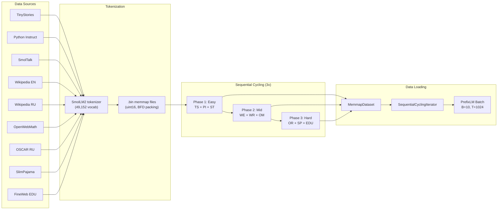
