# HAGI Architecture Diagrams

Diagrams are Mermaid-compatible. Each diagram maps to a subsystem or pipeline stage from `implementation_plan.md`.

---

## 1. High-Level System Architecture

```mermaid
flowchart TB
    subgraph Input["Input Boundary"]
        TOK[Token IDs + Position IDs]
        MASK[PrefixLM Mask]
        PART[Packed Partition]
    end

    subgraph HRM["HRM — Hierarchical Recurrent Model"]
        direction TB
        EMB[Embedding Layer]
        TBLOCK[TransformerBlock<br/>Self-Attn + MLP]
        HSTATE[HTransition<br/>z_H strategic state]
        LSTATE[LTransition<br/>z_L tactical state]
    end

    subgraph HDIM["HDIM — Domain-Invariant Mapping"]
        direction TB
        PROJ[HiddenToMultivector<br/>[B,T,hidden] -> [B,T,heads,blades]]
        EXTR[InvariantExtractor<br/>U = R^-1 * G * R]
        XFER[DomainTransfer<br/>G_target = R_target * U * R_target^-1]
        FUSE[GatedFusion<br/>gated residual -> hidden]
    end

    subgraph MSA["MSA — Memory Sparse Attention"]
        direction TB
        RKEY[Routing Key Compute<br/>Clifford scalar product]
        TOPK[Top-k Slot Selection]
        KVAPP[Append-Only K/V Cache]
        RopeDoc[Document-wise RoPE]
    end

    subgraph Output["Output Boundary"]
        LOGIT[Logits]
        LOSS[Composite Loss<br/>L_CE + L_aux + L_iso]
    end

    TOK --> EMB
    EMB --> TBLOCK
    TBLOCK --> HSTATE
    HSTATE --> LSTATE
    LSTATE --> TBLOCK
    LSTATE --> PROJ
    PROJ --> EXTR
    EXTR --> XFER
    XFER --> FUSE
    FUSE --> HSTATE
    EXTR --> RKEY
    RKEY --> TOPK
    TOPK --> KVAPP
    KVAPP --> RopeDoc
    RopeDoc --> TBLOCK
    TBLOCK --> LOGIT
    LOGIT --> LOSS
    MASK --> TBLOCK
    PART --> TBLOCK
```

**Contract boundaries**
- TensorRuntime boundary: every arrow carries `TensorSpec` (shape, dtype, layout, backend).
- HDIM bridge: `bridge_preserves_hidden_shape` guarantees fused output matches input hidden shape.
- MSA routing: `RouteWithinSlots` guarantees every selected `slotId` exists in registry.

---

## 2. HRM Recurrence Algorithm

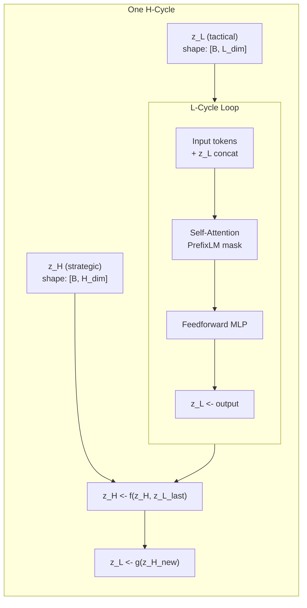

**Algorithm (pseudocode)**

```
function HRMForward(tokens, z_H, z_L, prefix_mask, partition):
    for h in 1..H_cycles:
        for l in 1..L_cycles:
            x = Embed(tokens) + project_z_L(z_L)   // broadcast z_L to hidden dim
            x = TransformerBlock(x, mask=prefix_mask, partition=partition)
            z_L = UpdateL(x, z_L)          // tactical recurrence
        z_H = UpdateH(z_H, z_L)             // strategic update
        z_L = ResetL(z_H)                  // tactical reset from new strategy
    return logits, z_H, z_L
```

**Invariants**
- `shape(z_H)` constant across all `HTransition` calls.
- `shape(z_L)` constant across all `LTransition` calls.
- `PrefixLMLegal(q, k)` rejects prefix->suffix attention edges.
- `PackedPartition` guarantees no sequence overlap in batch.

---

## 3. HRM Training Pipeline

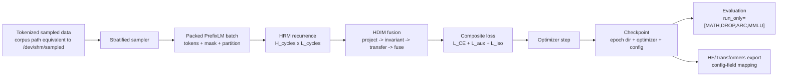

---

## 4. HDIM Clifford Pipeline

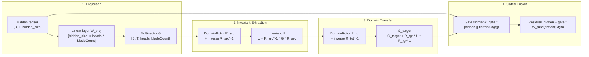

**Algorithm (pseudocode)**

```
function HDIMForward(hidden, rotor_src, rotor_tgt):
    // 1. Project
    G = reshape(linear(hidden), [B, T, heads, bladeCount])

    // 2. Extract invariant (rotor sandwich)
    U = geometric_product(geometric_product(rotor_src.inverse, G), rotor_src.value)

    // 3. Transfer to target domain
    G_target = geometric_product(rotor_tgt.value,
                                 geometric_product(U, rotor_tgt.inverse))

    // 4. Gated fusion back to hidden
    gate = sigmoid(W_gate * concat(hidden, flatten(G_target)))
    fused = hidden + gate * W_fuse(flatten(G_target))
    return fused
```

**Proof obligation**
- `same_rotor_transfer_identity`: if `rotor_src == rotor_tgt` and rotor is `UnitRotor`, then `HDIMForward(hidden, r, r) == hidden` modulo `FloatApprox ε`.

---

## 5. MSA Sparse Routing Algorithm

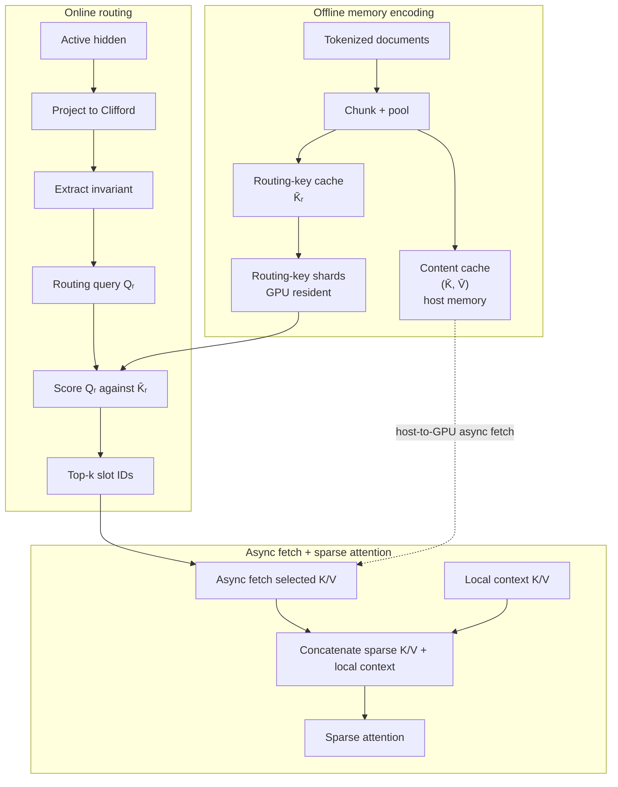

**Algorithm (pseudocode)**

```
function MSARoute(query_hidden, routing_key_shards, host_kv_cache, local_kv, k_select=5):
    Q_r = HDIM.ExtractInvariant(Project(query_hidden))
    scores = ScoreOnGpu(Q_r, routing_key_shards)
    selected = TopK(scores, k_select)

    assert all(s in host_kv_cache for s in selected)     // RouteWithinSlots
    assert len(set(selected)) == len(selected)           // No duplicates

    sparse_kv = AsyncFetch(host_kv_cache, selected)
    WaitForFetch(sparse_kv)
    K_cat, V_cat = concat(sparse_kv, local_kv, dim=seq)
    output = Attention(query_hidden, K_cat, V_cat)
    return output, selected
```

**Invariants**
- `CacheAppendOnly`: new slots append, old slots remain prefix.
- `SameRoPEDocument`: positions from different documents never mix.
- Routing-key shards are GPU-resident; content K/V pages remain in host memory until selected.

---

## 6. Memory Interleave Loop

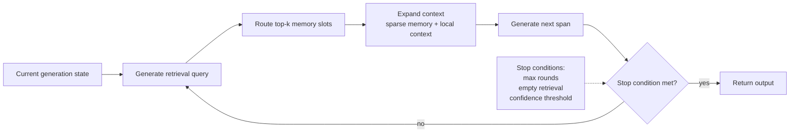

---

## 7. End-to-End Data Flow with Memory Interleave

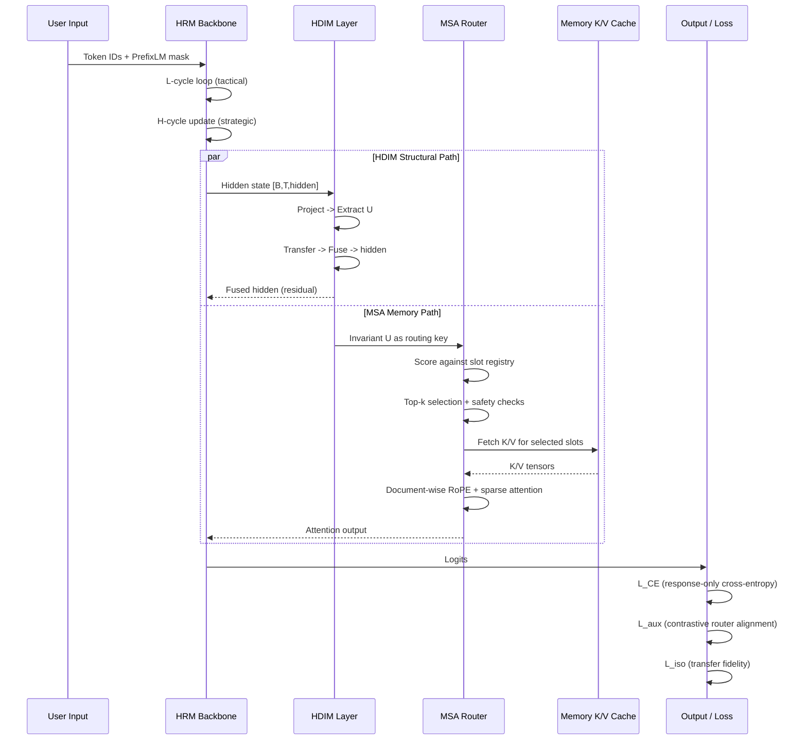

**Critical path**
- Training: HRM -> HDIM -> HRM -> Loss (no MSA needed per step, MSA is inference-optional for M4-M6).
- Inference with memory: HRM -> HDIM (parallel) -> MSA -> HRM -> logits.

---

## 8. HDIM Transfer State

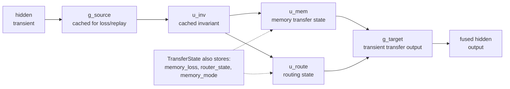

---

## 9. Composite Loss Computation

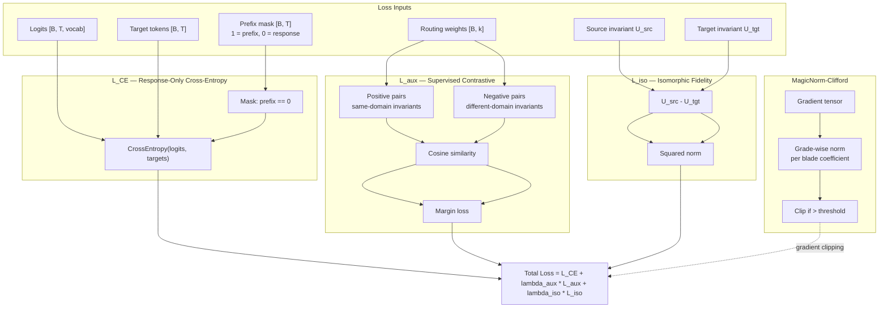

**Algorithm (pseudocode)**

```
function CompositeLoss(logits, targets, prefix_mask, router_weights,
                       U_src, U_tgt, lambda_aux, lambda_iso):
    // L_CE — only on response tokens
    response_positions = (prefix_mask == 0)
    L_CE = CrossEntropy(logits[response_positions],
                        targets[response_positions])

    // L_aux — router alignment: maximize similarity for matching invariants,
    // minimize for non-matching (different structure or domain)
    pos_sim = CosineSimilarity(U_src, U_matched)   // structurally matching pair
    neg_sim = CosineSimilarity(U_src, U_random)    // non-matching pair
    L_aux = Mean(ReLU(margin - pos_sim + neg_sim))

    // L_iso — transfer fidelity penalty
    L_iso = Mean((U_src - U_tgt)^2)

    // Total
    loss = L_CE + lambda_aux * L_aux + lambda_iso * L_iso

    // Gradient norm bound (MagicNorm-Clifford)
    grads = Autograd(loss)
    for grad in grads:
        if CliffordGradeNorm(grad) > threshold:
            grad *= threshold / CliffordGradeNorm(grad)

    return loss
```

**Contracts**
- `L_CE` finite and non-NaN on toy batch.
- `L_aux` increases cosine of matching invariants, decreases for negatives.
- `L_iso = ||U_src - U_tgt||^2` penalizes transfer discrepancy.
- Gradient norms bounded by `MagicNorm-Clifford` to prevent blade-coefficient explosion.

---

## 10. Milestone Dependency Graph

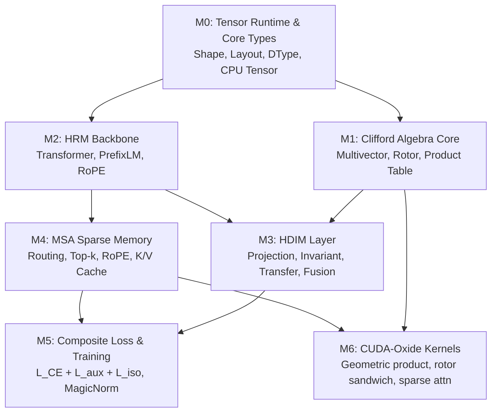

**Critical path (training)**: M0 -> M1 -> M3 -> M5
**Secondary path (inference scaling)**: M0 -> M2 -> M4 -> M6

---

## 11. Verification Stack

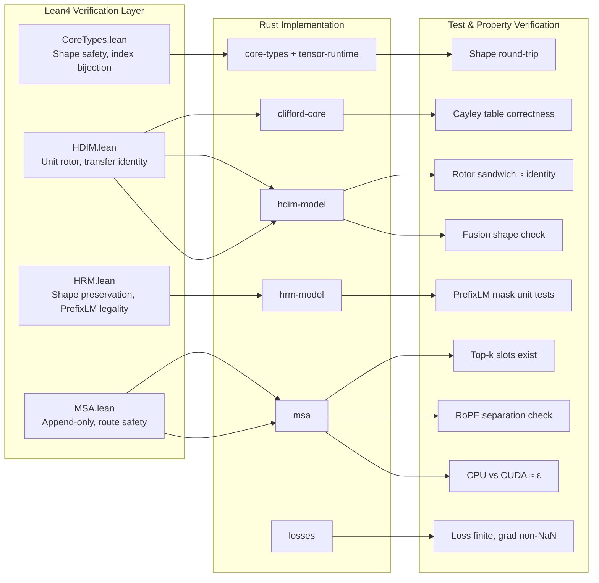

---

## 12. Formal Verification Traceability

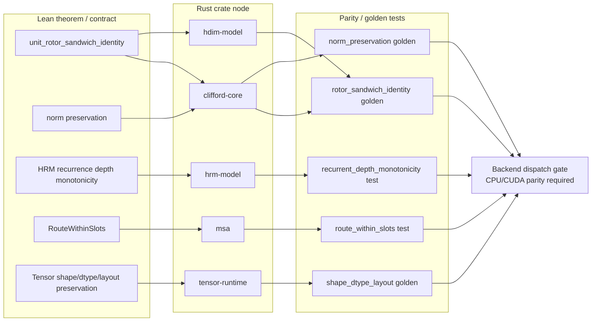

For milestone dependencies, risk analysis, and stop-conditions see [`implementation_plan.md`](implementation_plan.md).
For algorithmic complexity, resource estimates, and realizability verification see [`realizability_verification.md`](realizability_verification.md).
