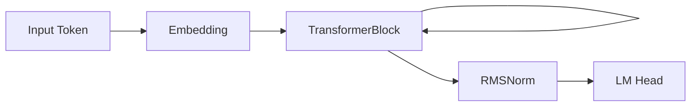
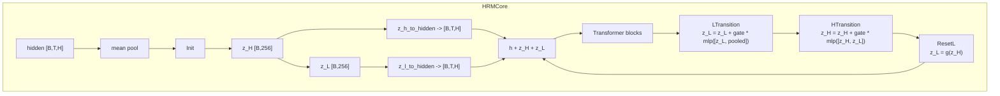
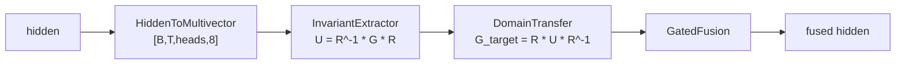
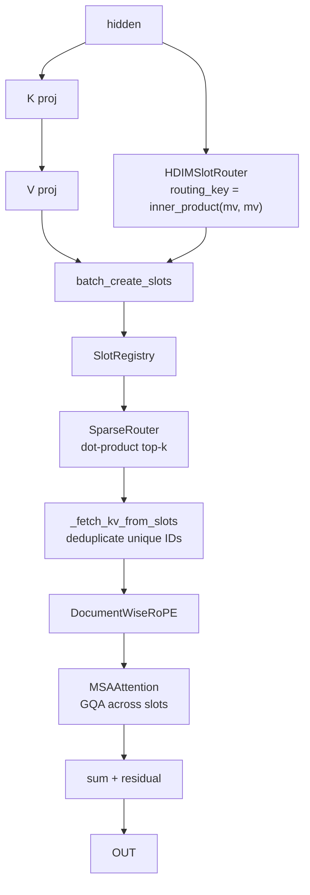
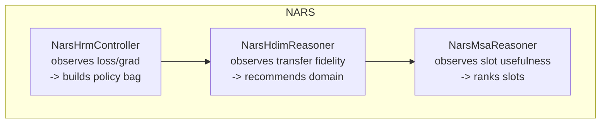

# HAGI — What the Code Actually Is

HAGI is a **modular experimental Transformer framework** with pluggable subsystems for recurrent reasoning, Clifford representations, external memory, and symbolic control. 175M parameters, 12 layers, 768 hidden, 49152 vocab.

This document describes what is **actually implemented** in the Python code, not what is claimed in READMEs or architectural vision documents.

---

## 1. Honest Overview

```
                Transformer Backbone
                         │
        ┌────────────────┼────────────────┐
        │                │                │
        ▼                ▼                ▼
      HRM             HDIM/GDR          MSA
        │                │                │
        └────────────────┼────────────────┘
                         │
                     Hidden State
                         │
                         ▼
                      LM Head

                         ▲
                         │
                       NARS
                 (active controller)
```

The core is a standard Transformer. Everything else is optional and gated by config flags.

---

## 2. Transformer — The Real Core

Files: `model/transformer.py`, `model/hagi.py`

This is the actual engine. The rest is bolted on top.


```mermaid
flowchart LR
    A["Input Token"] --> EMB["Embedding"] --> BLOCK["TransformerBlock"] --> BLOCK --> BLOCK --> NORM["RMSNorm"] --> HEAD["LM Head"]
```

**What actually exists:**

| Component | Status | Notes |
|---|---|---|
| Embeddings | Real | Standard `nn.Embedding`, weight-tying with LM head |
| RoPE | Real | Rotary position embedding, cached per device/dtype |
| GQA | Real | 12 query / 4 KV heads, `scaled_dot_product_attention` |
| RMSNorm | Real | Triton kernel on CUDA, PyTorch fallback |
| SwiGLU | Real | `down(silu(gate) * up)` |
| MoE | Real | 8 experts, top-2 routing, load-balancing aux loss |
| Binary Factorized | Real | 1-bit low-rank linear layers with STE |
| Gradient Checkpointing | Real | Per-block, `use_reentrant=False` |

**What does NOT exist:**
- No PrefixLM masking in the actual forward pass (flag exists but code path is bypassed)
- No novel attention mechanism — standard PyTorch SDPA

---

## 3. HRM — A Real Two-Level Recurrent Controller

File: `model/hrm_full.py`

This is a genuine recurrent mechanism, not a stub.


```mermaid
flowchart TB
    subgraph HRM["HRMCore"]
        H["hidden [B,T,H]"] --> POOL["mean pool"] --> INIT["Init"]
        INIT --> ZH["z_H [B,256]"] --> ZL["z_L [B,256]"]
        ZH --> EXP_H["z_h_to_hidden -> [B,T,H]"]
        ZL --> EXP_L["z_l_to_hidden -> [B,T,H]"]
        EXP_H --> ADD["h + z_H + z_L"]
        EXP_L --> ADD
        ADD --> BLOCKS["Transformer blocks"] --> LU["LTransition<br/>z_L = z_L + gate * mlp([z_L, pooled])"]
        LU --> HU["HTransition<br/>z_H = z_H + gate * mlp([z_H, z_L])"]
        HU --> RESET["ResetL<br/>z_L = g(z_H)"]
        RESET --> ADD
    end
```

**What actually exists:**
- `HTransition` — updates strategic state `z_H` from `z_L`
- `LTransition` — updates tactical state `z_L` from transformer output
- `ResetL` — resets `z_L` from `z_H` after each H-cycle
- `z_h_to_hidden` / `z_l_to_hidden` — linear projections that broadcast recurrent states to token level
- H-cycles (outer) × L-cycles (inner)
- GDR can be injected inside each L-cycle
- **NARS active controller** — `compute_gating()` truth-weighted modulation of `z_H` and `z_L` before broadcast

**What it actually is:**
> A latent controller + iterative refinement loop on top of Transformer, with NARS truth-weighted gating.

---

## 4. HDIM / GDR — Clifford Geometry That Exists

Files: `model/clifford.py`, `model/gdr.py`, `model/hdim_full.py`

Real Clifford algebra code is present.


```mermaid
flowchart LR
    H["hidden"] --> PROJ["HiddenToMultivector<br/>[B,T,heads,8]"] --> INV["InvariantExtractor<br/>U = R^-1 * G * R"] --> XFER["DomainTransfer<br/>G_target = R * U * R^-1"] --> FUSE["GatedFusion"] --> OUT["fused hidden"]
```

**What actually exists:**

| Component | Status |
|---|---|
| `geometric_product()` | Real — einsum over precomputed Cayley table, or Triton kernel |
| `grade_projection()` | Real — mask by popcount |
| `reverse()` | Real — sign = `(-1)^(k(k-1)/2)` |
| `bivector_exp()` | Real — closed-form rotor exponentiation |
| `DomainRotor` | Real — learnable, normalized to unit multivectors |
| `InvariantExtractor` | Real — rotor sandwich `R^-1 * G * R` |
| `DomainTransfer` | Real — rotor sandwich `R * U * R^-1` |
| `GatedFusion` | Real — sigmoid gate + residual |
| `GradeDecomposedRecurrence` | Real — 5 grades with different momentum |

**What works:**
- Mathematical transformations are implemented and run.
- GDR splits hidden state into 5 grades, applies per-grade MLPs, adds geometric interaction.
- **Sparse gating** — `gate_scalar`, `gate_vector`, `gate_bivector`, `gate_trivector` (sigmoid) control grade activation, allowing unused grades to be soft-gated off.
- **HDIM bypass** — when `use_hdim_cross_domain=False`, projection is skipped entirely (identity pass).

**What is NOT proven by the code:**
- That Clifford representations improve training quality.
- The code can *construct* them, but there is no evidence in the codebase that they produce better results than standard MLPs.

---

## 5. MSA — Real External Memory

File: `model/msa.py`

This is not just attention with a fancy name.


```mermaid
flowchart TB
    H["hidden"] --> K["K proj"] --> V["V proj"] --> SLOTS["batch_create_slots"] --> REG["SlotRegistry"]
    H --> ROUTE["HDIMSlotRouter<br/>routing_key = inner_product(mv, mv)"] --> SLOTS
    REG --> TOPK["SparseRouter<br/>dot-product top-k"] --> FKV["_fetch_kv_from_slots<br/>deduplicate unique IDs"] --> DROPE["DocumentWiseRoPE"] --> ATT["MSAAttention<br/>GQA across slots"] --> SUM["sum + residual"] --> OUT
```

**What actually exists:**
- `MemorySlot` — slot with routing key, K cache, V cache, domain_id
- `SlotRegistry` — **LRU eviction**, lazy tensor caching, pinned memory for non-blocking GPU transfer
- `SparseRouter` — dot-product top-k selection
- `HDIMSlotRouter` — routing key derived from Clifford scalar invariant
- `MSAAttention` — GQA attention across fetched slots with document-wise RoPE, **NARS truth-weighted modulation**
- `batch_create_slots` / `batch_register` — vectorized slot creation

**What it actually is:**
> LRU slots + nearest-neighbor routing + NARS truth-weighted attention. Simple external KV cache with active control.

There is NO complex long-term cognitive memory. Just a registry of K/V tensors with dot-product retrieval and LRU eviction.

---

## 6. NARS — Partially Implemented, Observer Role

Files: `nars/adapters.py`, `nars/truth.py`, `nars/budget.py`, `nars/bag.py`

Minimal OpenNARS-like primitives exist.


```mermaid
flowchart TB
    subgraph NARS["NARS"]
        HRM["NarsHrmController<br/>observes loss/grad<br/>-> builds policy bag"] --> HDIM["NarsHdimReasoner<br/>observes transfer fidelity<br/>-> recommends domain"] --> MSA["NarsMsaReasoner<br/>observes slot usefulness<br/>-> ranks slots"]
    end
```

**What actually exists:**
- `TruthValue` — frequency + confidence
- `BudgetValue` — priority + durability + quality
- `Bag` — priority-based bag with capacity limit
- `truth_revision()` — Bayesian-style update
- `budget_decay()` — exponential decay

**What the adapters actually do:**

| Adapter | Input | Output | Role |
|---|---|---|---|
| `NarsHrmController` | loss, grad_norm | `HrmControlPolicy` (h_cycles, l_cycles) + **truth-weighted gating** | Active controller — sets loop counts and modulates z_H/z_L |
| `NarsHdimReasoner` | transfer fidelity | Recommended domain pair | Observer — suggests domains |
| `NarsMsaReasoner` | slot usefulness | Blended top-k + **attention weights** | Active controller — reranks slots and modulates attention |

**What it actually is:**
> An active control layer that both observes and drives the model. NOT a central reasoning mechanism, but it directly modulates HRM and MSA forward passes.

NARS watches training and proposes adjustments, while also applying truth-weighted gating to recurrent states and attention weights.

---

## 7. Lean — Removed from Python Runtime

The Python `lean/` bridge has been removed. Formal verification specification lives in `formalization/HAGI/` (Lean4 source) and is not part of the Python compute graph.

The model does NOT depend on Lean during forward/backward.

---

## 8. What Is Actually the Core vs. Extension

### Core (remove these and nothing works)

```
Transformer (embedding + blocks + norm + head)
Training loop (forward/backward/optimizer)
Loss computation (cross-entropy)
```

### Working Extensions (remove these and model still trains, but differently)

```
HRM        — recurrent controller wrapper
HDIM/GDR   — Clifford representation layer
MSA        — external memory slots
MoE        — mixture of experts
```

### Overlays (remove these and model trains identically)

```
Lean       — formal verification (in formalization/, not in Python runtime)
```

---

## 9. Originality Assessment

| Component | Originality | Assessment |
|---|---|---|
| Transformer | Standard | Well-known architecture |
| HRM | Unusual | Real two-level recurrent controller with NARS truth-weighted gating |
| Clifford/GDR | Rare | Uncommon idea, sparse gating improves efficiency, unproven benefit |
| MSA | Variation | Standard external memory + LRU + NARS attention modulation |
| NARS integration | Most original | Active controller: modulates HRM gating and MSA attention weights |

**Overall characterization:**

> A **neuro-symbolic modular transformer framework** with an active symbolic control layer that modulates recurrent states and attention weights. Not a fundamentally new type of network, but an unusual combination with real feedback loops.

---

## 10. Model Parameters

| Parameter | Value |
|---|---|
| Total params | 175M |
| Layers | 12 (4 perception + 4 reasoning + 4 expression) |
| Hidden size | 768 |
| Vocab size | 49152 |
| Attention heads | 12 Q / 4 KV |
| Intermediate size | 2048 |
| Max sequence | 2048 |
| MoE experts | 8, top-2 |
| MoE intermediate | 512 per expert |
| GDR grades | scalar 64, vector 192, bivector 192, trivector 64, residual 256 |
| HRM dims | z_H 256, z_L 256 |
| HRM cycles | h=1, l=2 |
| HDIM heads | 4 |
| MSA slots | 100, top-k 5 |

---

## 11. File Structure

```
src/hagi/model/
├── hagi.py              # Main model — gates all optional modules
├── transformer.py       # The real core: RMSNorm, RoPE, GQA, SwiGLU, MoE, BFL
├── hrm_full.py         # HRMCore — two-level recurrent controller
├── gdr.py              # GradeDecomposedRecurrence — 5-grade split
├── hdim_full.py        # HDIM — Clifford domain transfer
├── clifford.py         # Cl(3,0,0) algebra — geometric_product, grade_projection, etc.
├── msa.py              # MSAAttention, SlotRegistry, SparseRouter
├── moe.py              # MoESwiGLU — 8 experts, top-2 routing
├── triton_kernels.py   # CUDA kernels (geometric_product, sparse_attn, RMSNorm)
├── binary_factorized.py # 1-bit STE linear layers
└── nars/adapters.py    # NARS controllers — observer layer

src/hagi/nars/
├── truth.py            # TruthValue, truth_revision
├── budget.py           # BudgetValue, budget_decay
├── bag.py              # Priority bag
└── adapters.py         # NarsHrmController, NarsHdimReasoner, NarsMsaReasoner

src/hagi/train/
├── optim.py            # Muon, AdamW, ScheduleFree, AdamMini, CombinedOptimizer
├── loop.py             # Training loop, checkpoint save/load
├── checkpoint.py       # Checkpoint utilities
└── config.py           # Config parsing

scripts/
├── train.py            # Main training script (basic/fast/full modes)
├── chat.py             # Interactive inference
└── download_data.py    # Data download

formalization/
└── HAGI/               # Lean4 verification spec (not part of Python runtime)
```

---

## 12. Training Summary

| Aspect | Implementation |
|---|---|
| Optimizers | AdamW (fused), Muon + AdamW hybrid, ScheduleFree, AdamMini |
| Schedule | Cosine or WSD (warmup-stable-decay) |
| Loss | Composite: CE + aux + iso + moe_aux, with warmup |
| EMA | CPU-based, `_foreach_` ops |
| Precision | fp16 with GradScaler |
| Memory | `empty_cache()` every 10 steps, `del` intermediates |
| Batch | 2, grad_accum 8 |
| Steps | 8000 |
| Data | 150M tokens, 10 mixed sources |
