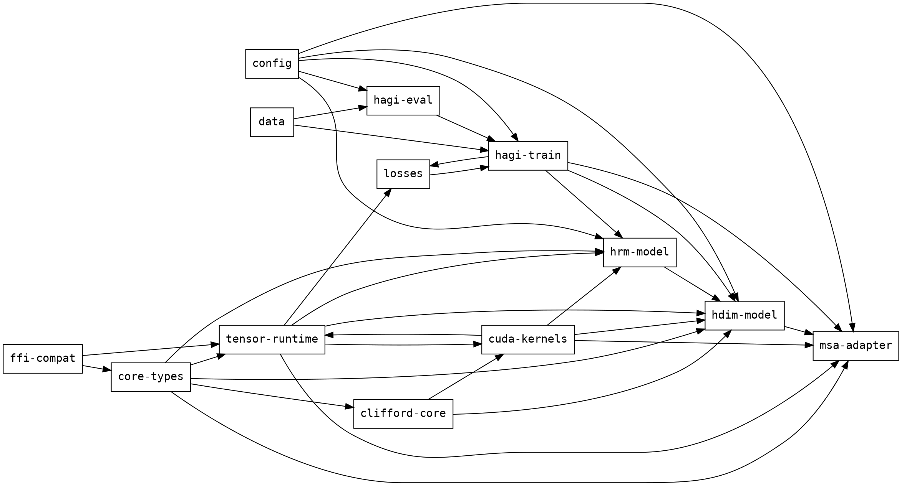

# HAGI Implementation Plan

This plan defines crate boundaries, public API seams, algorithms, complexity targets, tests, and fallbacks for the HAGI implementation. Canonical numbers match `docs/ARCHITECTURE.md`: HRM `n_layers = 24`, `hidden_size = 1280`, `num_heads = 10`, `expansion = 4`, `H_cycles = 2`, `L_cycles = 3`, `bp_warmup_ratio = 0.2`, `bp_max_steps = 5`, HDIM `Cl<3,0,0>`, and MSA `top_k` selected slots from `slot_count` registered slots.

## Crate Dependency Graph



## M0: Tensor Runtime and Core Types

### Objective
Build the contiguous tensor substrate and shared typed IDs used by every model crate.

### Complexity target
Forward tensor indexing is `O(rank)` per logical access and `O(numel)` for contiguous iteration. Memory is `O(numel)` contiguous elements plus `O(rank)` metadata. Default `Layout` stores strides as `[fast_dim, ..., slow_dim]`, and `alignment_bytes = next_power_of_two(dtype_size)`.

### Crate / Module boundary
- Crate: `core-types`
- Primary modules: `core_types::{shape, layout, dtype, ids}`
- Crate: `tensor-runtime`
- Primary modules: `tensor_runtime::{tensor, backend, ops}`
- Dependencies: none for `core-types`; `tensor-runtime` depends on `core-types`.

### Public API signature
```rust
pub fn canonical_blocked_layout(shape: &Shape, dtype: DType, l1_cache_line_bytes: usize) -> Layout;

pub fn from_vec<T: TensorElement>(
    spec: TensorSpec,
    data: Vec<T>,
    backend: Backend,
) -> Result<Tensor<T>, TensorError>;

pub trait BackendOp {
    fn dispatch(&self, inputs: &[TensorView<'_>], output: TensorViewMut<'_>) -> Result<(), TensorError>;
}
```

### Data structure
```rust
pub struct Layout {
    pub strides: SmallVec<[usize; 8]>,
    pub alignment_bytes: usize,
    pub block_elems_fast_dim: usize,
}

pub struct TensorSpec {
    pub shape: Shape,
    pub dtype: DType,
    pub layout: Layout,
}
```
Invariant: tensor base pointer offset satisfies `offset % layout.alignment_bytes == 0`; `block_elems_fast_dim = max(1, l1_cache_line_bytes / dtype.size_bytes())`; storage length equals `shape.numel()`.

### Algorithm
1. Validate `shape.rank() == layout.strides.len()`.
2. Compute `alignment_bytes = dtype.size_bytes().next_power_of_two()`.
3. Set fast dimension stride to `1` and slow dimensions by cumulative product.
4. Set `block_elems_fast_dim = max(1, l1_cache_line_bytes / dtype.size_bytes())`.
5. Allocate one contiguous buffer of `shape.numel()` elements.
6. Reject tensor construction if base pointer alignment violates `offset % alignment_bytes == 0`.
7. Iterate fast dimension in blocks of `block_elems_fast_dim`; iterate slow dimensions outside the fast loop.

### Test milestone
- Compile: `cargo check -p core-types -p tensor-runtime` passes.
- Unit: `index_to_offset(offset_to_index(i)) == i` for all `i < numel` on ranks `1..=6`.
- Property: every constructed tensor reports `base_offset % alignment_bytes == 0`.
- Benchmark: contiguous sum over `1_048_576` `f32` elements is within `1.25x` of direct slice iteration on CPU reference.

### Risk & fallback
Risk: blocked layout breaks callers that assume row-major order. Fallback: expose `Layout::row_major(shape, dtype)` and keep blocked layout behind `canonical_blocked_layout` until parity tests pass.

## M1: Clifford Core

### Objective
Implement `Cl<3,0,0>` multivectors, rotor sandwich, and table-driven geometric products.

### Complexity target
Blade grade lookup is `O(1)`. Geometric product for dense multivectors is `O(blade_count^2)` with `blade_count = 2^dim`; rotor sandwich on basis blades is `O(blade_count)` per multivector by table lookup for `Cl<3,0,0>`. Memory is `O(blade_count^2)` for the product table and `O(blade_count)` for grade lookup; for `Cl<3,0,0>`, table entries = `8 * 8 = 64`.

### Crate / Module boundary
- Crate: `clifford-core`
- Primary modules: `clifford_core::{signature, blade, table, multivector, rotor}`
- Dependencies: `core-types`

### Public API signature
```rust
pub trait CliffordAlgebra<const P: usize, const Q: usize, const R: usize> {
    const DIM: usize = P + Q + R;
    const BLADE_COUNT: usize = 1 << Self::DIM;

    fn product(a: &Multivector<Self>, b: &Multivector<Self>) -> Multivector<Self>
    where
        Self: Sized;
}

pub fn rotor_sandwich_cl3(
    rotor: &UnitRotor<Cl3>,
    input: &Multivector<Cl3>,
) -> Multivector<Cl3>;
```

### Data structure
```rust
pub struct ProductEntry {
    pub sign: i8,
    pub result_index: u16,
}

pub struct ProductTable<const N: usize> {
    pub grade_lookup: [u8; N],
    pub product_table: [[ProductEntry; N]; N],
}

pub struct Multivector<A> {
    pub coeffs: Box<[f32]>,
    pub algebra: PhantomData<A>,
}
```
Invariant: `coeffs.len() == 2^dim`; `grade_lookup[i] == i.count_ones()` for Euclidean `Cl<3,0,0>`; every `product_table[a][b].result_index < blade_count`.

### Algorithm
1. Build `grade_lookup[2^dim]` by `blade_index.count_ones()`.
2. Build `product_table[2^dim][2^dim] -> (sign, result_index)` at compile time for `Cl<3,0,0>`.
3. For a product term `(a, b)`, read `entry = product_table[a][b]`.
4. Accumulate `out[entry.result_index] += entry.sign as f32 * lhs[a] * rhs[b]`.
5. For rotor sandwich on basis blades, skip generic recursion and use table lookups for `R * blade * R_inverse`.
6. Skip zero coefficients before multiplying; blocked coefficient ranges use cache-line chunks from M0 layout.
7. Return dense `Multivector<Cl3>` with unchanged `blade_count`.

### Test milestone
- Compile: `cargo check -p clifford-core` passes.
- Unit: `GRADE_LOOKUP_CL3 == [0,1,1,2,1,2,2,3]`.
- Golden: `PRODUCT_TABLE_CL3` matches the checked `Cl<3,0,0>` Cayley table.
- Property: unit rotor sandwich with identity rotor returns input within `1e-6` absolute error.

### Risk & fallback
Risk: const table generation exceeds stable const-eval limits. Fallback: store `GRADE_LOOKUP_CL3` and `PRODUCT_TABLE_CL3` as checked static arrays and gate generic table generation behind tests.

## M2: HRM Backbone

### Objective
Implement fixed-depth HRM recurrence with early exit, Prefix-LM mask reuse, and scheduled truncated backprop depth.

### Complexity target
Forward pass is `O(B * T * n_layers * (T * hidden_size + hidden_size * hidden_size * expansion) * H_eff * L_eff)` where `H_eff <= H_cycles_max` and `L_eff <= L_cycles_max`. Canonical constants: `n_layers = 24`, `hidden_size = 1280`, `num_heads = 10`, `expansion = 4`, `H_cycles_max = 2`, `L_cycles_max = 3`. Memory is `O(B * T * hidden_size)` for states plus `O(B * T * T)` for one cached Prefix-LM mask per packed batch.

### Crate / Module boundary
- Crate: `hrm-model`
- Primary modules: `hrm_model::{config, mask, rope, block, recurrence, state}`
- Dependencies: `core-types`, `tensor-runtime`, `config`

### Public API signature
```rust
pub struct HRMConfig {
    pub n_layers: usize,
    pub hidden_size: usize,
    pub num_heads: usize,
    pub expansion: usize,
    pub h_cycles_max: usize,
    pub l_cycles_max: usize,
    pub convergence_eps: f32,
    pub bp_warmup_ratio: f32,
    pub bp_max_steps: usize,
    pub warmup_steps: usize,
}

pub fn forward_hrm(
    model: &HrmBackbone,
    batch: &PackedBatch,
    state: HRMState,
    step: usize,
) -> Result<HRMOutput, HrmError>;

pub fn scheduled_bp_steps(config: &HRMConfig, step: usize) -> usize;
```

### Data structure
```rust
pub struct HRMState {
    pub z_h: Tensor<f32>,
    pub z_l: Tensor<f32>,
}

pub struct PrefixLmMask {
    pub packed_shape: Shape,
    pub bits: BitVec,
}
```
Invariant: `z_h.shape == z_l.shape == [batch, tokens, hidden_size]`; `PrefixLmMask` is computed once per `PackedBatch` and reused by all H/L recurrence steps.

### Algorithm
1. Build `PrefixLmMask` once for the packed batch.
2. Compute `bp_steps = scheduled_bp_steps(config, step)`.
3. `scheduled_bp_steps` returns `floor(bp_max_steps * min(1.0, step / warmup_steps) / bp_warmup_ratio)` clamped to `0..=bp_max_steps`.
4. For `h in 0..h_cycles_max`, save `prev_z_h`.
5. For `l in 0..l_cycles_max`, save `prev_z_l`.
6. Run L transition with cached mask and current `z_h`.
7. Break L loop if `norm(z_l - prev_z_l) < convergence_eps * max(norm(prev_z_l), tiny)`.
8. Run H transition from final `z_l`.
9. Break H loop if `norm(z_h - prev_z_h) < convergence_eps * max(norm(prev_z_h), tiny)`.
10. Attach recurrence trace only for the last `bp_steps`; detach earlier states.
11. Return logits, final state, effective cycle counts, and mask checksum.

### Test milestone
- Compile: `cargo check -p hrm-model` passes.
- Unit: `scheduled_bp_steps` returns `0` at step `0` and `bp_max_steps` after warmup for canonical config.
- Unit: Prefix-LM mask checksum is unchanged across all H/L cycles in one forward pass.
- Property: output state shape is preserved for `(H,L) = (1,1), (2,3), (4,4)`.
- Golden: with zero transition weights, early exit occurs after one H cycle and one L cycle.

### Risk & fallback
Risk: convergence threshold exits too early during training. Fallback: set `convergence_eps = 0.0` in config to force full canonical `2 * 3` recurrence.

## M3: HDIM Layer

### Objective
Implement hidden-to-Clifford projection, rotor-LUT domain transfer, and fused HRM injection.

### Complexity target
Projection is `O(B * T * hidden_size * blade_count * structural_heads)`. Rotor transfer with LUT is `O(B * T * structural_heads * blade_count)` for two table lookups and two sandwich applications; unseen pairs add `O(blade_count)` rotor construction. Canonical `Cl<3,0,0>` gives `blade_count = 8`. Memory is `O(rotor_count^2 * blade_count)` for registered transfer LUT and `O(B * T * structural_heads * blade_count)` for multivectors.

### Crate / Module boundary
- Crate: `hdim-model`
- Primary modules: `hdim_model::{config, projection, invariant, transfer, fusion}`
- Dependencies: `core-types`, `tensor-runtime`, `clifford-core`, `hrm-model`, `config`

### Public API signature
```rust
pub fn project_hidden_to_multivector(
    projection: &HiddenToMultivector,
    hidden: TensorView<'_, f32>,
) -> Result<MultivectorBatch<Cl3>, HdimError>;

pub fn transfer_domain(
    registry: &TransferRegistry<Cl3>,
    source_domain: DomainId,
    target_domain: DomainId,
    source: &MultivectorBatch<Cl3>,
) -> Result<MultivectorBatch<Cl3>, HdimError>;

pub fn fused_hrm_hdim_inject(
    hrm_hidden: TensorView<'_, f32>,
    hdim_signal: &MultivectorBatch<Cl3>,
    output: TensorViewMut<'_, f32>,
) -> Result<(), HdimError>;
```

### Data structure
```rust
pub struct TransferRegistry<A> {
    pub domains: Vec<DomainRotor<A>>,
    pub rotor_lut: HashMap<(DomainId, DomainId), UnitRotor<A>>,
}

pub struct MultivectorBatch<A> {
    pub coeffs: Tensor<f32>,
    pub structural_heads: usize,
    pub algebra: PhantomData<A>,
}
```
Invariant: `rotor_lut[(s,t)] = normalized(R_t * inverse(R_s))`; `coeffs.shape == [batch, tokens, structural_heads, blade_count]`; every registered rotor satisfies unit norm within `1e-5`.

### Algorithm
1. Project `hidden[B,T,1280]` to `coeffs[B,T,structural_heads,8]`.
2. Validate source and target domains exist.
3. Read `R_pair = rotor_lut[(source_domain, target_domain)]`.
4. If LUT miss, compute `R_pair = normalize(R_target * inverse(R_source))` and insert it.
5. Transfer by `G_target = R_pair ⊗ G_source ⊗ inverse(R_pair)`.
6. Fuse HRM projection and HDIM injection in one kernel path: read hidden tile, compute projected coefficients, apply transfer, gate residual, write output tile.
7. On CPU reference, keep the same API and execute the fused path as one loop nest to avoid host round-trip semantics.

### Test milestone
- Compile: `cargo check -p hdim-model` passes.
- Unit: registry stores canonical pair rotor for every `transfer_domains` pair in config.
- Property: same-domain transfer returns input within `1e-5` absolute error.
- Golden: LUT hit count equals transfer call count for registered pairs.
- Benchmark: fused CPU loop performs one write of `[B,T,hidden_size]` output per call.

### Risk & fallback
Risk: LUT normalization drift breaks unit rotor invariant. Fallback: recompute and renormalize pair rotor on every transfer when `debug_assertions` detect norm error above `1e-5`.

## M4: MSA Sparse Memory Adapter

### Objective
Implement sparse top-k memory routing over registered slots without full softmax or full-token attention.

### Complexity target
Routing score is `O(slot_count * routing_key_dim)`. Stable radix ordering over `u16` slot IDs is `O(slot_count)` after score bucketization; fallback comparison sort is `O(slot_count log slot_count)`. Attention is `O((local_context + top_k_pages) * hidden_size)` and never `O(100M * hidden_size)`. Memory is `O(slot_count * routing_key_dim)` on GPU for routing keys plus host content K/V pages for selected slots.

### Crate / Module boundary
- Crate: `msa-adapter`
- Primary modules: `msa_adapter::{slot, registry, route, kv_cache, sparse_attention}`
- Dependencies: `core-types`, `tensor-runtime`, `hrm-model`, `hdim-model`, `config`

### Public API signature
```rust
pub fn route_top_k(
    registry: &SlotRegistry,
    query: RoutingQueryView<'_>,
    top_k: usize,
) -> Result<RouteSelection, MsaError>;

pub fn fetch_selected_pages_async(
    cache: &HostKvCache,
    selection: &RouteSelection,
    stream: BackendStream,
) -> Result<FetchEvent, MsaError>;

pub fn sparse_memory_attention(
    local_context: TensorView<'_, f32>,
    fetched_pages: FetchedKvPages<'_>,
    output: TensorViewMut<'_, f32>,
) -> Result<(), MsaError>;
```

### Data structure
```rust
pub struct MemorySlot {
    pub slot_id: u16,
    pub domain_id: DomainId,
    pub routing_key: Tensor<f32>,
    pub content_page_ref: PageRef,
}

pub struct RouteSelection {
    pub slot_ids: SmallVec<[u16; 16]>,
    pub raw_scores: SmallVec<[f32; 16]>,
    pub normalized_weights: SmallVec<[f32; 16]>,
}
```
Invariant: `slot_count <= u16::MAX as usize + 1`; `slot_ids.len() <= top_k`; `sum(normalized_weights) == 1` when sum of selected raw scores is non-zero; every selected slot ID exists in `SlotRegistry`.

### Algorithm
1. Project active hidden state to routing query `Q_r`.
2. Score every slot by dot product `score = Q_r · K_bar_r`.
3. Store `(score, slot_id)` for every registered slot.
4. Sort slot IDs by score descending using stable radix sort on `u16` IDs with score buckets.
5. Select first `top_k` slot IDs.
6. Normalize weights by `score_i / sum_top_k_scores`; if sum is zero, use uniform `1/top_k`.
7. Issue selected slot IDs to host K/V cache.
8. While GPU scores next routing-key shard, CPU DMA streams selected content pages to the backend stream.
9. Sparse attention waits on `FetchEvent` and attends only over local context plus fetched top-k pages.
10. Return empty selection when registry has no slots; generation loop stops on empty selection.

### Test milestone
- Compile: `cargo check -p msa-adapter` passes.
- Unit: query over 100 slots with `top_k = 5` returns 5 existing IDs sorted by descending raw score.
- Unit: raw-score normalization sum is within `1e-6` of `1.0`.
- Golden: no call path allocates attention tensors over unselected slots.
- Integration: memory interleave loop stops on `max_rounds`, empty selection, or confidence threshold.

### Risk & fallback
Risk: radix score bucketization changes ordering for close `f32` scores. Fallback: use stable comparison sort with `(score desc, slot_id asc)` for CPU and correctness tests; enable radix route only for CUDA backend.

## M5: Composite Loss and Training Loop

### Objective
Train HRM+HDIM+MSA with exact AdamW, clipped gradients, scheduled evaluation, async checkpoints, and annealed isomorphic loss.

### Complexity target
Each training step is `O(forward + backward + parameter_count)`; optimizer update is `O(parameter_count)`. Memory is `O(parameter_count)` for weights, `O(parameter_count)` for gradients, and `O(2 * parameter_count)` for AdamW first and second moments. Evaluation adds one forward pass on one benchmark subset every `eval_every_n_steps`.

### Crate / Module boundary
- Crate: `losses`
- Primary modules: `losses::{cross_entropy, auxiliary, isomorphic, total}`
- Crate: `hagi-train`
- Primary modules: `hagi_train::{loop, optimizer, checkpoint, eval_hook}`
- Dependencies: `core-types`, `tensor-runtime`, `hrm-model`, `hdim-model`, `msa-adapter`, `losses`, `data`, `config`

### Public API signature
```rust
pub fn total_loss(
    logits: TensorView<'_, f32>,
    targets: TensorView<'_, u32>,
    aux: AuxTargets<'_>,
    iso: IsoPairBatch<'_>,
    weights: LossWeights,
) -> Result<LossBreakdown, LossError>;

pub fn adamw_step(
    params: &mut [Parameter],
    grads: &[Gradient],
    state: &mut AdamWState,
    config: AdamWConfig,
) -> Result<(), TrainError>;

pub fn train_step(
    trainer: &mut Trainer,
    batch: PackedBatch,
) -> Result<TrainStepReport, TrainError>;
```

### Data structure
```rust
pub struct AdamWConfig {
    pub lr: f32,
    pub beta1: f32,
    pub beta2: f32,
    pub eps: f32,
    pub weight_decay: f32,
    pub max_norm: f32,
}

pub struct LossWeights {
    pub lambda_aux: f32,
    pub lambda_iso_target: f32,
    pub iso_warmup_steps: usize,
}
```
Invariant: default AdamW uses `beta1 = 0.9`, `beta2 = 0.95`, `eps = 1e-8`, decoupled weight decay, and gradient clipping `max_norm = 1.0`; `lambda_iso(step)` anneals linearly from `0.0` to `lambda_iso_target` over `iso_warmup_steps`.

### Algorithm
1. Run forward through HRM, HDIM, MSA, and logits head.
2. Compute `L_CE` only over response tokens.
3. Compute `L_aux` as auxiliary next-token prediction on synthetic invariant targets.
4. Compute `L_iso` over source-target invariant pairs.
5. Set `lambda_iso = lambda_iso_target * min(1.0, step / iso_warmup_steps)`.
6. Compute `L_total = L_CE + lambda_aux * L_aux + lambda_iso * L_iso`.
7. Backpropagate through scheduled recurrence trace from M2.
8. Clip global gradient norm to `1.0`.
9. Apply AdamW: update moments, bias-correct moments, apply Adam step, then decoupled weight decay.
10. Every `ckpt_every_n_steps`, snapshot parameters and optimizer state to host and write checkpoint asynchronously.
11. Every `eval_every_n_steps`, evaluate one benchmark subset.
12. Stop early after `patience = 3` evals without improvement.

### Test milestone
- Compile: `cargo check -p losses -p hagi-train` passes after crate creation.
- Unit: AdamW one-parameter update matches hand-computed value for `beta1 = 0.9`, `beta2 = 0.95`, `eps = 1e-8`.
- Unit: clipped gradient norm is `<= 1.0`.
- Unit: `lambda_iso(0) == 0.0` and `lambda_iso(iso_warmup_steps) == lambda_iso_target`.
- Integration: 100 toy steps reduce `L_total` and produce at least one async checkpoint report.

### Risk & fallback
Risk: async checkpoint writes race with mutable parameter buffers. Fallback: copy checkpoint tensors to an immutable host snapshot before spawning the writer thread.

## M6: CUDA-Oxide Backend

### Objective
Implement CUDA-Oxide kernels and dispatch paths for fused HDIM, HRM, and MSA inference.

### Complexity target
Fused kernel work is `O(B * T * (blade_count + hidden_size * expansion + slot_shard_count * routing_key_dim))` per launch. Memory traffic target is one read of HRM hidden tile and one write of output tile; rotor, HRM update, and route score intermediates remain in registers/shared memory. Occupancy target is `>= 50%` on SM100; fallback triggers when register pressure exceeds `128` registers per thread.

### Crate / Module boundary
- Crate: `cuda-kernels`
- Primary modules: `cuda_kernels::{launch, fused, rotor, hrm, msa, parity}`
- Dependencies: `core-types`, `tensor-runtime`, `clifford-core`, `hrm-model`, `hdim-model`, `msa-adapter`, `cuda-oxide`

### Public API signature
```rust
pub fn launch_fused_rotor_hrm_msa(
    stream: CudaStream,
    input: DeviceTensorView<'_, f32>,
    rotor_lut: DeviceRotorLut<'_, Cl3>,
    hrm_weights: DeviceHrmWeights<'_>,
    routing_keys: DeviceRoutingKeys<'_>,
    output: DeviceTensorViewMut<'_, f32>,
) -> Result<KernelReport, CudaKernelError>;

pub fn dispatch_or_fallback(
    op: FusedHagiOp<'_>,
    backend: Backend,
) -> Result<KernelReport, TensorError>;
```

### Data structure
```rust
pub struct KernelReport {
    pub launched_fused: bool,
    pub registers_per_thread: u16,
    pub occupancy_percent: f32,
    pub used_tma: bool,
}

pub struct DeviceRoutingKeys<'a> {
    pub shards: &'a [DeviceTensorView<'a, f32>],
    pub slot_ids: &'a [u16],
}
```
Invariant: fused path requires `registers_per_thread <= 128`; `occupancy_percent >= 50.0`; routing `slot_ids` match M4 registry IDs; CPU/CUDA parity absolute error is `<= backend_parity_tolerance`, canonical `1e-4`.

### Algorithm
1. Load hidden tile into registers.
2. Warp-specialize within the block: warps `0..=3` compute Clifford rotor apply.
3. Warps `4..=7` run HRM MLP update.
4. Warps `8..=11` score MSA route shards.
5. Keep rotor result and HRM hidden update in registers/shared memory.
6. Use TMA to async load selected K/V pages for MSA route output.
7. Emit route scores and fused hidden output without host round-trip.
8. If compile report shows `registers_per_thread > 128`, dispatch three kernels: `rotor_apply`, `hrm_update`, `msa_route_score`.
9. If runtime occupancy report is `< 50%` on SM100, record fallback recommendation and keep correctness path enabled.
10. Validate CUDA output against CPU reference in parity tests.

### Test milestone
- Compile: `cargo check -p cuda-kernels` passes when CUDA-Oxide toolchain is available.
- Unit: vecadd-style CUDA-Oxide launch succeeds before fused kernel tests run.
- Property: fused kernel output matches CPU reference within `1e-4` for fixed seed tensors.
- Benchmark: fused path uses one grid launch; fallback path uses three grid launches.
- Benchmark: fused kernel reports `occupancy_percent >= 50.0` and `registers_per_thread <= 128` on SM100 target profile.

### Risk & fallback
Risk: fused kernel exceeds register budget or CUDA-Oxide lacks required TMA lowering. Fallback: execute separate kernels and use host-staged async K/V copies through the `tensor-runtime` backend stream API.

## M7: Evaluation and Acceptance

### Objective
Verify end-to-end behavior, crate integration, benchmark thresholds, and artifact compatibility.

### Complexity target
Evaluation forward pass is `O(HRM + HDIM + MSA_top_k)` per benchmark batch. Memory is bounded by one benchmark subset, one local context window, and `top_k` fetched memory pages.

### Crate / Module boundary
- Crate: `hagi-eval`
- Primary modules: `hagi_eval::{bench, golden, report}`
- Dependencies: `hagi-train`, `data`, `config`, `tensor-runtime`

### Public API signature
```rust
pub fn run_eval_subset(
    checkpoint: &CheckpointRef,
    subset: BenchmarkSubset,
    config: EvalConfig,
) -> Result<EvalReport, EvalError>;

pub fn compare_golden_outputs(
    cpu: &EvalReport,
    cuda: &EvalReport,
    tolerance: f32,
) -> Result<GoldenDiff, EvalError>;
```

### Data structure
```rust
pub struct EvalReport {
    pub loss_total: f32,
    pub loss_ce: f32,
    pub route_top_k_hit_rate: f32,
    pub effective_h_cycles_mean: f32,
    pub effective_l_cycles_mean: f32,
    pub backend: Backend,
}
```
Invariant: report contains one row per evaluated subset; CPU and CUDA golden comparison uses the same checkpoint, batch order, routing registry, and `backend_parity_tolerance`.

### Algorithm
1. Load checkpoint produced by M5.
2. Build evaluation subset with deterministic order.
3. Run CPU reference forward and collect `EvalReport`.
4. If CUDA backend is available, run CUDA forward on identical batches.
5. Compare logits, losses, route IDs, and selected slot counts against CPU reference.
6. Emit failure if absolute numeric error exceeds `backend_parity_tolerance = 1e-4`.
7. Emit failure if selected route IDs differ for non-tied scores.

### Test milestone
- Compile: `cargo check -p hagi-eval` passes after crate creation.
- Golden: CPU report is byte-stable for fixed seed and fixed checkpoint.
- Integration: `hagi-eval` can load one M5 checkpoint and evaluate one subset.
- Parity: CUDA report matches CPU report within `1e-4` when CUDA backend exists.

### Risk & fallback
Risk: CUDA route order differs on tied scores. Fallback: define tie order as `(score desc, slot_id asc)` and mark tied-score cases separately in the golden diff.

## Global Verification Matrix

| Milestone | Compile gate | Unit/property gate | Golden/benchmark gate | Dependency gate |
|---|---|---|---|---|
| M0 | `cargo check -p core-types -p tensor-runtime` | index/offset and alignment invariants | contiguous sum <= `1.25x` slice iteration | none |
| M1 | `cargo check -p clifford-core` | grade/table/identity rotor tests | Cayley table | M0 |
| M2 | `cargo check -p hrm-model` | BP schedule, mask reuse, shape preservation | zero-weight early exit | M0 |
| M3 | `cargo check -p hdim-model` | rotor LUT and same-domain transfer | fused loop single output write | M1, M2 |
| M4 | `cargo check -p msa-adapter` | top-k routing and weight normalization | no full-slot attention allocation | M2, M3 |
| M5 | `cargo check -p losses -p hagi-train` | AdamW, clipping, loss anneal | 100-step toy loss decrease | M2, M3, M4 |
| M6 | `cargo check -p cuda-kernels` | CPU/CUDA parity | fused launch, occupancy >= `50%` | M1, M2, M3, M4 |
| M7 | `cargo check -p hagi-eval` | deterministic eval report | CPU/CUDA golden diff <= `1e-4` | M5, M6 optional |

Project acceptance: M0-M5 compile and tests pass on CPU; M6 parity passes when CUDA-Oxide is available; M7 produces deterministic CPU report and CUDA golden diff when hardware exists.
